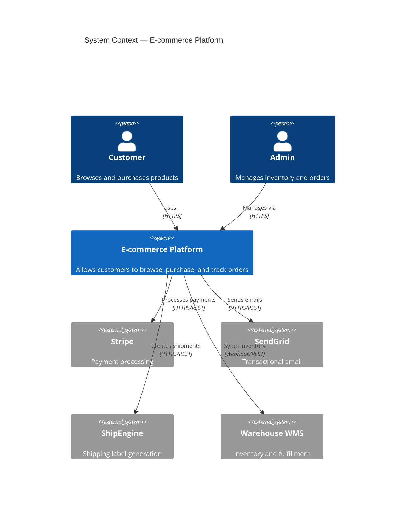
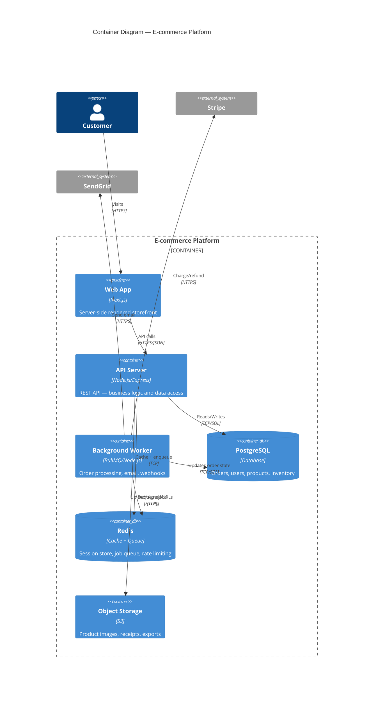
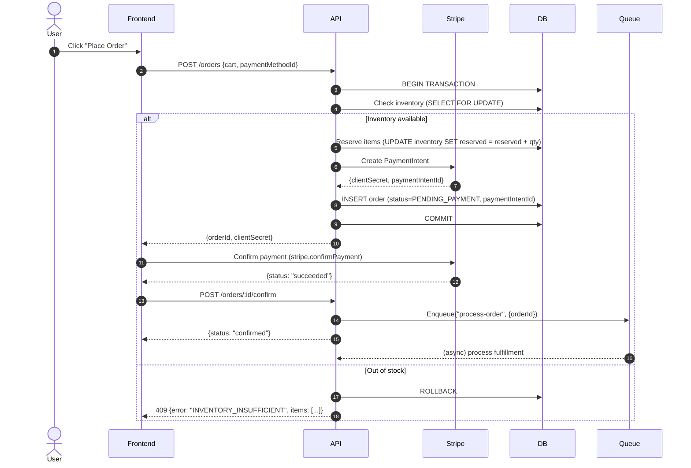
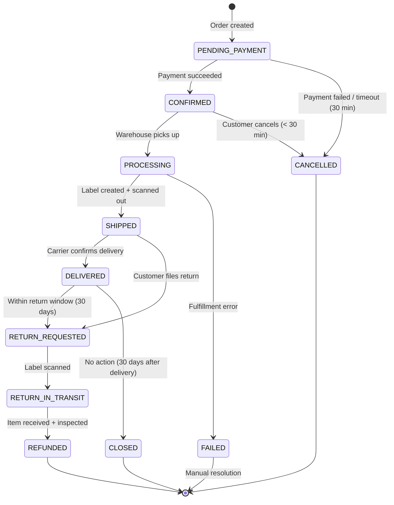
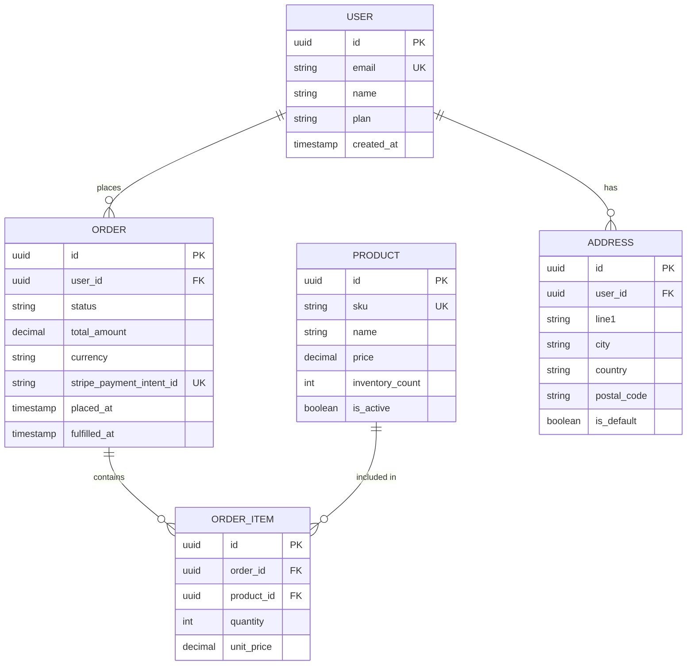
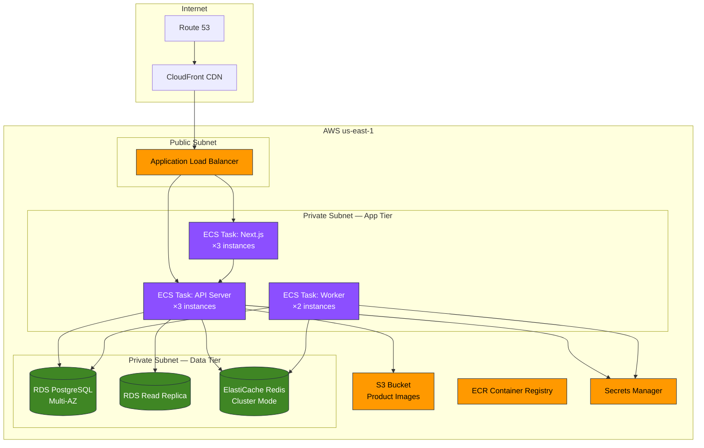
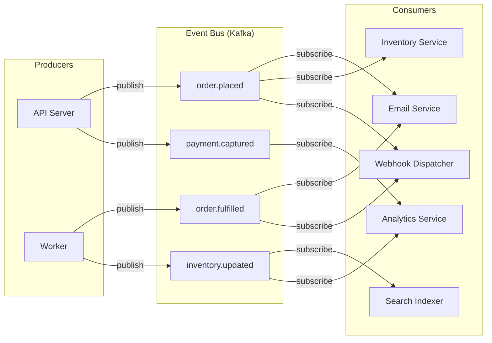

# Mermaid Diagram Examples for System Architecture

Copy-paste ready diagrams for common architectural patterns.
Render at: https://mermaid.live

---

## 1. System Context Diagram (C4 Level 1)

---

## 2. Container Diagram (C4 Level 2)

---

## 3. Sequence Diagram — Checkout Flow

---

## 4. State Diagram — Order Lifecycle

---

## 5. Entity Relationship Diagram

---

## 6. Deployment Diagram (Cloud Infrastructure)

---

## 7. Event-Driven Architecture

